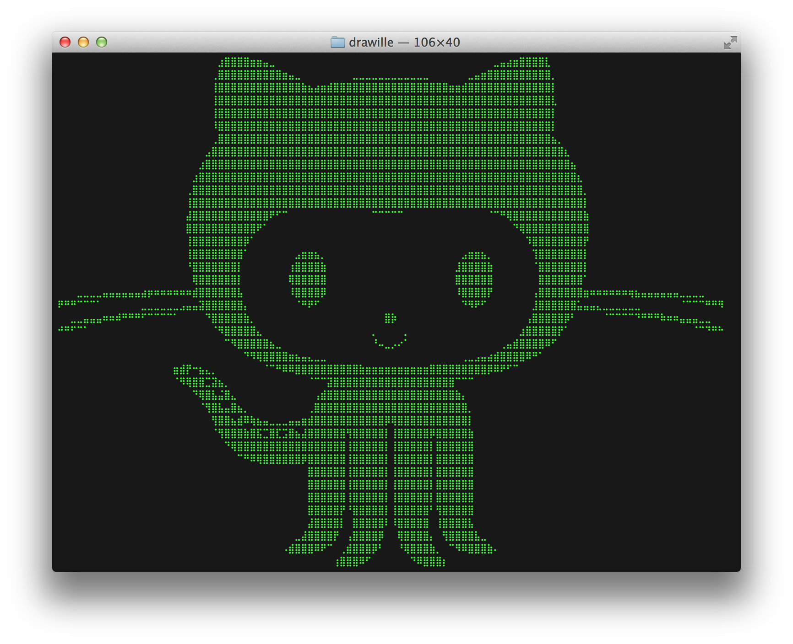
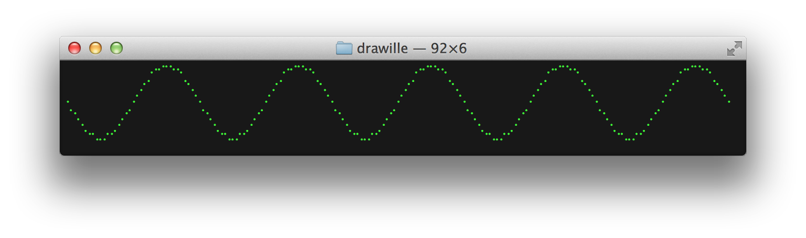
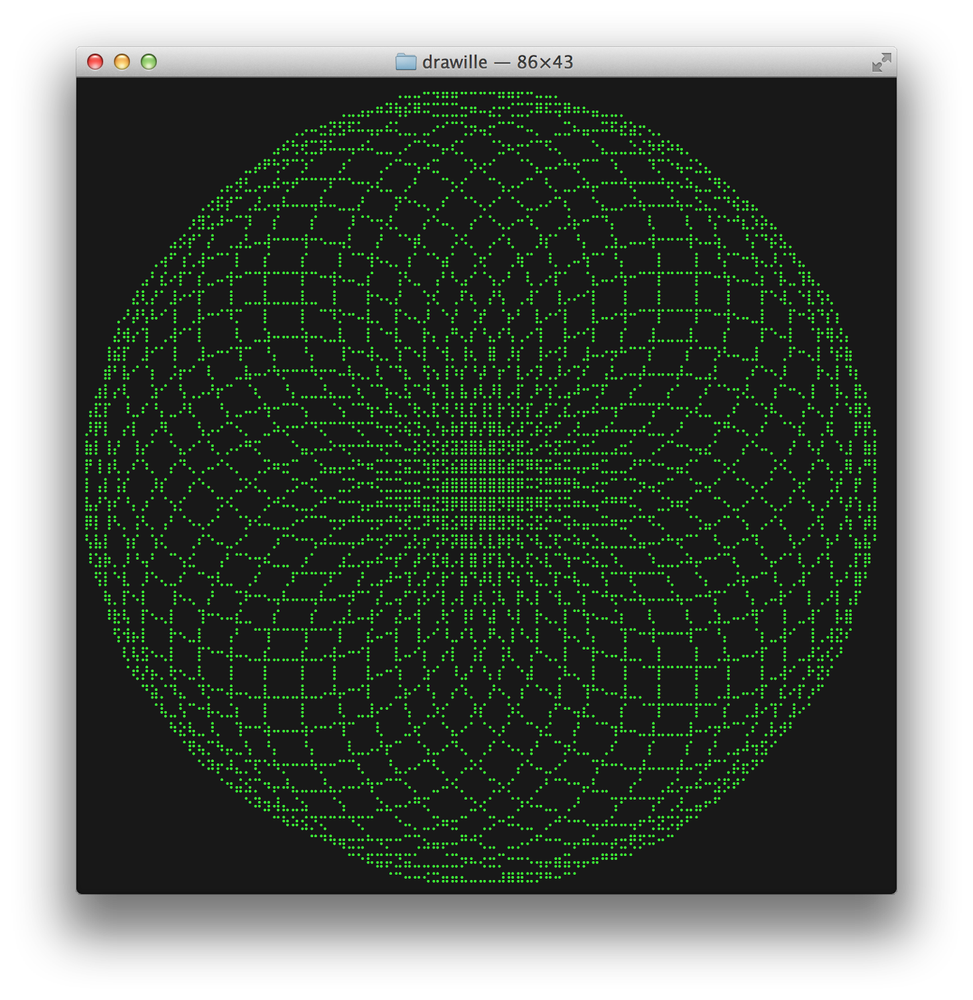

php-drawille
============

Terminal drawing with [braille](http://en.wikipedia.org/wiki/Braille).

## Requirements

php-drawille requires PHP 5.4.0 or later.

## Installation

The recommended way to install php-drawille is [through
composer](http://getcomposer.org). Just create a `composer.json` file and
run the `php composer.phar install` command to install it:

~~~json
{
    "require": {
        "whatthejeff/drawille": "~1.0"
    }
}
~~~

## Usage

~~~php
use Drawille\Canvas;

$canvas = new Canvas();

for($x = 0; $x <= 1800; $x += 10) {
    $canvas->set($x / 10, 10 + sin($x * M_PI / 180) * 10);
}

echo $canvas->frame(), "\n";
~~~

~~~php
use Drawille\Turtle;

$turtle = new Turtle();

for($x = 0; $x < 36; $x++) {
    $turtle->right(10);

    for($y = 0; $y < 36; $y++) {
        $turtle->right(10);
        $turtle->forward(8);
    }
}

echo $turtle->frame(), "\n";
~~~

## Tests

To run the test suite, you need [composer](http://getcomposer.org).

    $ php composer.phar install
    $ vendor/bin/phpunit

## Acknowledgements

php-drawille is a port of [drawille](https://github.com/asciimoo/drawille).

## License

php-drawille is licensed under the [MIT license](LICENSE).